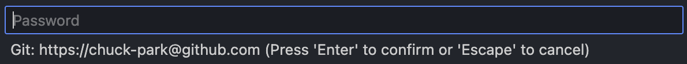
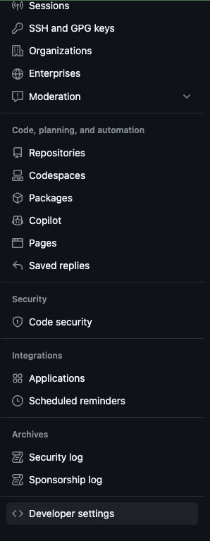
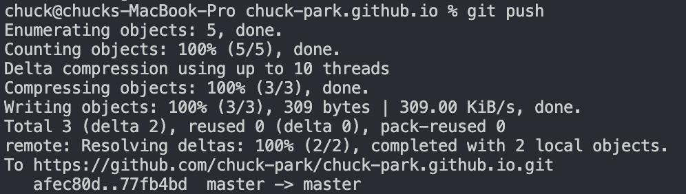

> 어느날 push를 하려고 하니 해당 repo에 권한이 없다고 403 에러가 뜬다.

# Introduction
Github에서 보안 강화를 위해 password 로그인을 막은 이후 토큰이 만료되거나 어떤 토큰이 어떤 계정에 대한 토큰인지 잊어버려서 특정 계정으로 repo 접근이 안되어 번거로울 때가 종종있다. 가끔해서 할 때마다 헷갈리니 글로 정리해보자.

# Contents
### remote repository URL 재설정

push를 하려고 하니 해당 repo에 권한이 없다고 403 에러가 떴다!


remote repo 주소를 확인해보니 잘되어있는데 비밀번호를 안물어보니 remote의 url을 다시 설정해보자.


```bash
// remote repository의 URL 재설정
git remote set-url origin {REMOTE_REPO_URL}
```


다시 push를 시도하니 password를 입력하라는 창이 뜬다.
나는 vscode를 써서 상단 search bar에 뜬다(잘 안보여서 한참 못찾음..)


password를 입력하니 password로 로그인하는 기능이 제거됐다고 한다.
password가 아니라 토큰을 발급 받아서 password 대신 token 값을 입력해주면 된다.

### Github Token 생성

token을 만든 적이 없거나 만료되어 새로 만들어야한다면 github 사이트에서 생성할 수 있다.
우선 settings로 이동하고,



settings에서 developer settings로 간다.


Fine-grained tokens 라는게 새로 나온 것 같은데 아직 preview 버전이라 나는 classic token을 사용하기로 했다.

참고로 Fine-grained tokens에 대해 알아보니 classic token에 비해서 보안이 강화된(이름처럼 권한이 세분화된) token이라고 한다.
- 각 토큰은 단독 유저나 조직이 소유하고 있는 리소스에만 접근할 수 있다
- 각 토큰은 특정한 repositories에만 접근할 수 있다
- 각 토큰은 classic token에 부여된 범위 보다 더 많은 제어를 할 수 있는 특정한 권한이 부여 된다
- 조직의 소유자는 조직의 리소스에 접근할 수 있는 find-grained personal access token에 대한 승인을 요구할 수 있다


repo scope에 꼭 체크해야 repo 관련 액션을 할 수 있으니 꼭 체크해야한다.


다시 password를 입력하는 창에 새로 발급한 token을 입력하고 push를 하니 잘된다.

+토큰을 github URL 앞에 적어주는 방식으로 password 입력을 대체할 수 있다고 한다!
```
git remote set-url origin https://{TOKEN}@github.com/chuck-park/chuck-park.github.io.git
``` 

### References
- [Github | The requested URL returned error: 403](https://iambeginnerdeveloper.tistory.com/256)
- [Managing your personal access tokens](https://docs.github.com/en/authentication/keeping-your-account-and-data-secure/managing-your-personal-access-tokens)